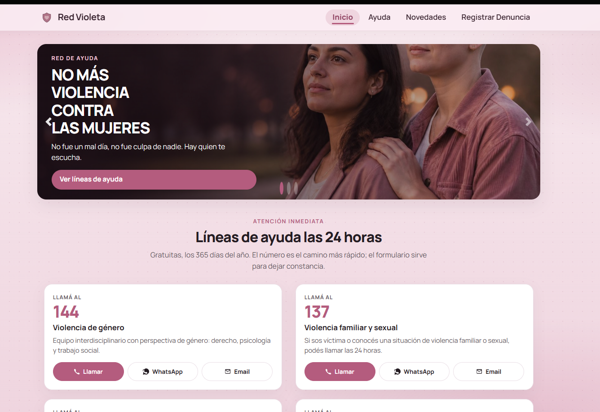
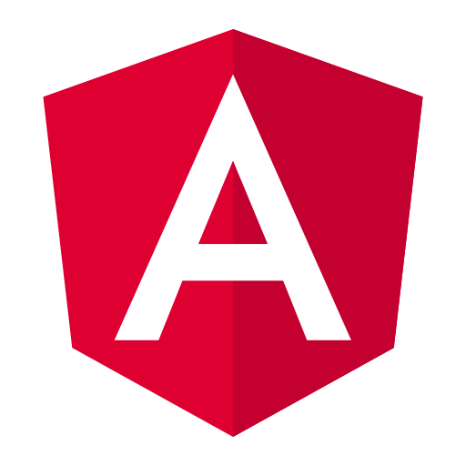
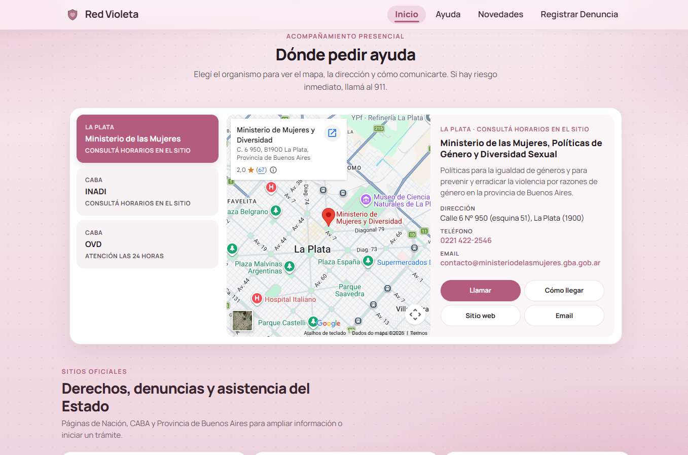
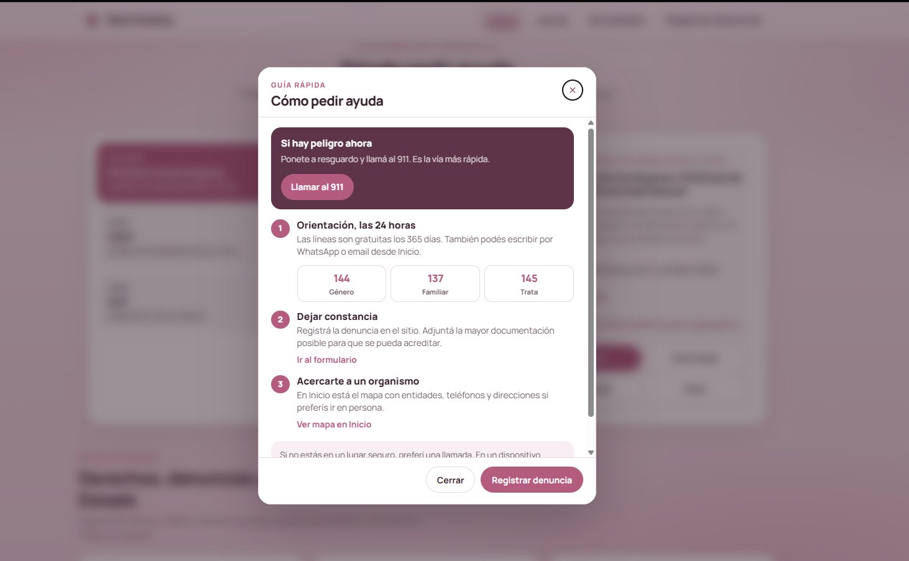
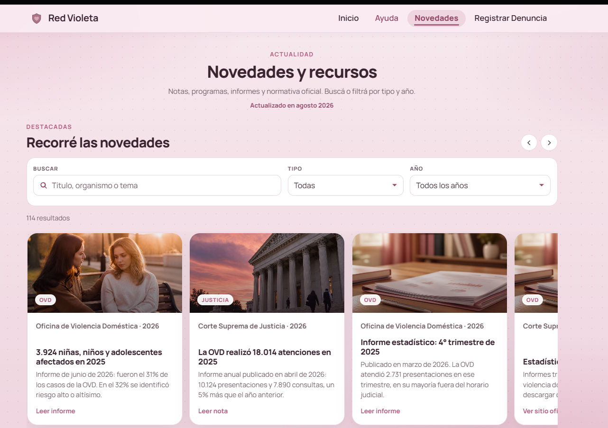
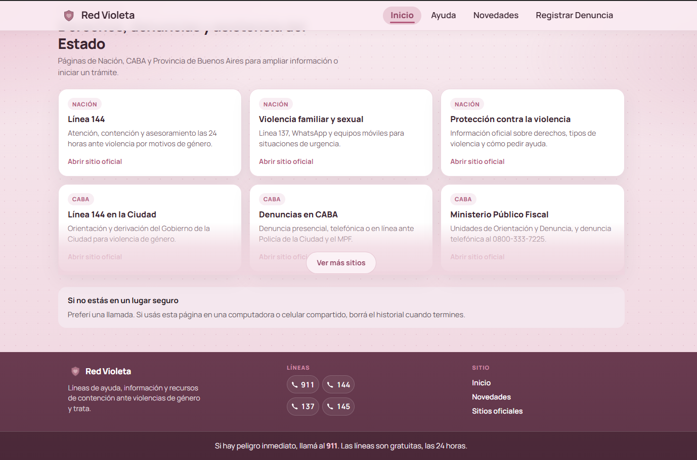

<div align="center">



</div>

<div align="right">
  
  
  
  
  
  
  
</div>

<br>

<br>

<div align="right">
  <a href="../../../README.md" title="Spanish">
    
  </a>
  <a href="./README.en.md" title="English">
    
  </a>
</div>

<br>

<div align="center">

# Red Violeta 

</div>

**Red Violeta** is a containment network for anyone facing **gender-based violence, discrimination or human trafficking** in Argentina. It brings together what is usually scattered: **24/7 helplines**, an **agency map**, **news** and **official sites** for Nación, CABA and Provincia de Buenos Aires.

Home puts help first: 144, 137 and 145 (call, WhatsApp or email), the *How to get help* guide (911 if there is immediate danger, orientation or leaving a record) and a map to reach an agency. There is also a news catalog, a form to register the situation, and access to State procedures and assistance. Built for desktop and phone, with a safety note for shared devices.

**Angular 22** frontend.

* [**App (production)**](https://red-violeta.vercel.app/inicio)
* [**App (local)**](http://localhost:4200/)
* [**Full README (Spanish)**](../../../README.md)

<br>

## Index 📜

<details>
  <summary>View details</summary>

<br>

<div align="right">

`Latest update: 28/08/26`

</div>

### Section 1) Description, setup and technologies

* [1.0) Description.](#10-description-)
* [1.1) Run the project.](#11-run-the-project-)
* [1.2) Technologies.](#12-technologies-)
* [1.3) Screenshots.](#13-screenshots-)

### Section 2) Pages and routes

* [2.0) Routes.](#20-routes-)
* [2.1) Product notes.](#21-product-notes-)

### Section 3) Deploy and references

* [3.0) Deploy.](#30-deploy-)
* [3.1) References.](#31-references-)

</details>

<br>

## Section 1) Description, setup and technologies

### 1.0) Description [🔝](#index-)

<details>
  <summary>View details</summary>

**Red Violeta** is built for the moment someone needs to **know what to do and whom to call**. It does not replace helplines or agencies: it brings them closer, in plain language, on desktop and on a phone.

**What is in the site**

* **24/7 helplines:** 144 (gender-based violence), 137 (family and sexual violence) and 145 (trafficking). Phone, WhatsApp and email, plus 911 if there is immediate danger.
* **How to get help:** three paths — safety, orientation or leaving a record.
* **Where to get help map:** agencies (La Plata, INADI, OVD and more) with call, directions and official site.
* **Official sites:** Nación, CABA and Provincia de Buenos Aires — rights, reports and State assistance, with “See more sites”.
* **News:** featured carousel and a library with search and type/year filters (notes, reports, programmes, regulations).
* **Register a report:** a form to leave a record and continue to the **helplines**.
* **Safer use:** a notice to prefer a call and clear history if the computer or phone is shared.

An **Angular 22** frontend, ready to consult: help first, paperwork after.

</details>

### 1.1) Run the project [🔝](#index-)

<details>
  <summary>View details</summary>

Node.js **22.22.3+** (`package.json` → `engines`).

```bash
git clone https://github.com/andresWeitzel/Red_Violeta_Website.git
cd Red_Violeta_Website
npm install
npm start
```

App: [http://localhost:4200/](http://localhost:4200/) (`/` → `/inicio`).

| Script | Description |
|--------|-------------|
| `npm start` | Dev server |
| `npm run build` | Production build (`dist/proyecto01/browser/`) |
| `npm test` | Vitest |

</details>

### 1.2) Technologies [🔝](#index-)

<details>
  <summary>View details</summary>

| Tech | Version | Role |
|------|---------|------|
| [Angular](https://angular.dev/) | 22.1.x | SPA |
| TypeScript | ~6.0 | Typing |
| Bootstrap | 4.5.3 (CDN) | Carousel / grid |
| [Vercel](https://vercel.com/) | — | Static hosting |
| Vitest | 4.x | Unit tests |

Component CSS budget in production: **8 kB** (`anyComponentStyle`). Shared UI lives in `src/styles.css`.

</details>

### 1.3) Screenshots [🔝](#index-)

<details>
  <summary>View details</summary>

<br>

Desktop captures in `public/assets/repository/`. **`01-cover-inicio.png`** is also the banner at the top of this README.

| File | What it shows |
|------|----------------|
| `01-cover-inicio.png` | **Home (hero).** Two women, *No más violencia. Contención y asistencia*, helplines 144 / 137 and *Ver líneas de ayuda*. |
| `02-inicio-mapa.png` | **Home — map.** *Dónde pedir ayuda*: agency tabs (La Plata, INADI, OVD, etc.) and card with call / directions / site. |
| `03-ayuda-guia.png` | **Home — guide.** *Cómo pedir ayuda* modal: immediate danger (911), orientation (144 / 137 / 145), leave a record. |
| `04-novedades.png` | **News.** Search, Type / Year filters and featured carousel. |
| `05-inicio-sitios.png` | **Home — official sites and footer.** Nación / CABA / PBA grid, safety notice and footer (brand, lines, site). |

<p align="center"></p>

<p align="center"><em>01 — Home cover</em></p>

<p align="center"></p>

<p align="center"><em>02 — Agency map</em></p>

<p align="center"></p>

<p align="center"><em>03 — How to get help</em></p>

<p align="center"></p>

<p align="center"><em>04 — News</em></p>

<p align="center"></p>

<p align="center"><em>05 — Official sites and footer</em></p>

</details>

<br>

## Section 2) Pages and routes

### 2.0) Routes [🔝](#index-)

<details>
  <summary>View details</summary>

| Path | Page |
|------|------|
| `/` | Redirect to `/inicio` |
| `/inicio` | Home: helplines, map, official sites |
| `/novedades` | News catalog, search, type/year filters |
| `/formulario-denuncias` | Demo form |
| `/lineas-de-atencion` | 144, 137, 145 |
| `**` | 404 |

</details>

### 2.1) Product notes [🔝](#index-)

<details>
  <summary>View details</summary>

* Home official sites: 3 cards on mobile; **6** on desktop (≥992 px) so “See more” sits on the **second** row.
* News filters: search + Type / Year selects.
* Form: identity or anonymous, email, kind, comment ≥10 chars, optional files, consent. Valid submit → confirm dialog → helplines page.

</details>

<br>

## Section 3) Deploy and references

### 3.0) Deploy [🔝](#index-)

<details>
  <summary>View details</summary>

```bash
npm run build
```

Publish `dist/proyecto01/browser/` on **Vercel**. Live: [red-violeta.vercel.app/inicio](https://red-violeta.vercel.app/inicio).

</details>

### 3.1) References [🔝](#index-)

<details>
  <summary>View details</summary>

* [Spanish README](../../../README.md)
* [App (production)](https://red-violeta.vercel.app/inicio)
* [GitHub repo](https://github.com/andresWeitzel/Red_Violeta_Website)
* Doc template: [ApiRest Electronic Devices ExpressJS](https://github.com/andresWeitzel/ApiRest_Electronic_Devices_ExpressJS)

By [Andrés Weitzel](https://github.com/andresWeitzel).

</details>
